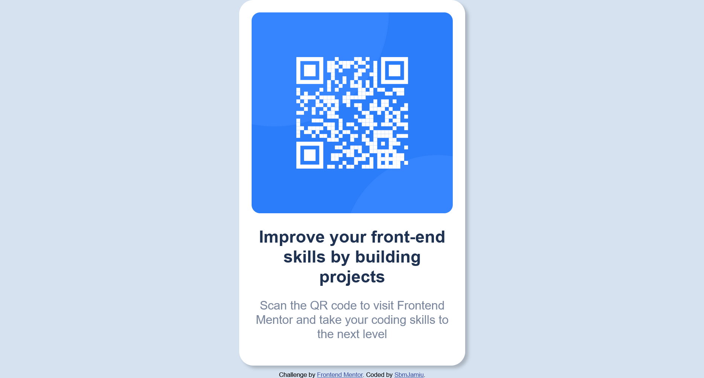

# Frontend Mentor - QR code component solution

This is a solution to the [QR code component challenge on Frontend Mentor](https://www.frontendmentor.io/challenges/qr-code-component-iux_sIO_H). Frontend Mentor challenges help you improve your coding skills by building realistic projects. 

## Table of contents

- [Overview](#overview)
  - [Screenshot](#screenshot)
  - [Links](#links)
- [My process](#my-process)
  - [Built with](#built-with)
  - [What I learned](#what-i-learned)
  - [Continued development](#continued-development)
  - [Useful resources](#useful-resources)
- [Author](#author)
- [Acknowledgments](#acknowledgments)

**Note: Delete this note and update the table of contents based on what sections you keep.**

## Overview

### Screenshot




### Links

- Solution URL: [My solution](https://github.com/sbmjamiu/Frontend-Mentor-QR-code-component)
- Live Site URL: [Add live site URL here](https://your-live-site-url.com)

## My process

### Built with

- Semantic HTML5 markup
- CSS custom properties
- Flexbox


### What I learned


```css
.container {
  box-shadow: 5px 5px 5px rgba(0, 0, 0, 0.2);
}
```

### Continued development

I will like to learn more on using rem instead of px for sizing and also learn the use of hsl more


### Useful resources


## Author

- Frontendmentor - [SbmJamiu](https://www.frontendmentor.io/profile/sbmjamiu)

- Twitter - [@sbm_jamiu](https://www.twitter.com/sbm_jamiu)


## Acknowledgments


